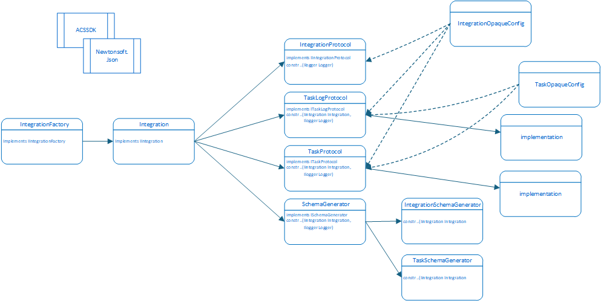

# Architecture
The ACS SDK consists of two primary components.

Component     | Description
------------- | -------------
**Discovery** | Is implemented by any consumer of the plugins developed using this SDK and simply serves as a means of finding and exposing the plugins to the Integration Consumer.
**plugin**    | Is responsible for building and providing integration functionality to the consumer. The plugin component has several sub-components which facilitate this.

## IIntegrationFactory
A single plugin can contain multiple distinct **Integrations**, which are managed by an implementation of the `IIntegrationFactory` interface.

The **IntegrationFactory** object provides a list of integration types (referred to as **Applications**) which it can construct. It also provides a method which, given a valid application and an initial configuration object, returns a new instance of that Integration.

## IIntegration
The IIntegration interface describes all of the necessary functionality for an integration.

In the ACS SDK, the Integration is responsible for defining it's own configuration UI utilizing the [`react-jsonschema-form`](https://github.com/rjsf-team/react-jsonschema-form) library.
The SchemaGenerator component is responsible for providing the JSON schemas necessary for this functionality.

The IIntegration interface also describes the three protocols which are required to manage an external application's tasks:
* IIntegrationProtocol
* ITaskProtocol
* ITaskLogProtocol

An implementation of the Integration interface can take many forms.
One implementation might be a long-running service; another might be a thin wrapper which simply invokes a REST-ful web API.
In any case, there is an Integration instance which implements the IIntegration interface and provides the above functionality.

### IIntegrationProtocol
The IIntegrationProtocol interface defines two methods which are used to monitor the status of the Integration.
The `InitialStatus` method is invoked just once in the Integration's lifecycle on initialization; in this method, the Integration should handle any initialization which it requires for subsequent operations.
The `Status` method is invoked at regular intervals as a heartbeat in order to ensure that the Integration is still operating as expected.

Both methods run asynchronously and return a `Result` record, which contains a status code and an enumerable containing any encountered exceptions.
A status code of `0` indicates that the Integration is running without exception; any other status code indicates that the Integration is not running (or will imminently stop).

### ITaskProtocol
The ITaskProtocol interface defines the following methods relating to task lifecycle management:

* `StartTask` - Begins a new task
* `TaskStatus` - Checks the status of a running task
* `CancelTask` - Stops execution of a running task

Each of the above methods takes as an argument both the integration configuration and the configuration for the specific task and returns a `TaskResult` which describes the current status code for the task.

The Integration is responsible for updating the appropriate configuration objects as it needs to keep track of state.
These objects are persistently shared with the Integration Consumer and so it is important that all state changes occur in the input configuration objects.

### IConfig
The `IConfig` interface describes the structure of configuration data utilized within the SDK. There are three distinct configuration objects associated with an `IConfig` implementation:

#### **Config**
The Config property is a dynamic object which contains all of the data necessary for the integration to configure and run tasks.
The `DataSchema` provided by the `ISchemaGenerator` should describe the shape and expected values for the appropriate implementation.
Accessing the current state of the Integration can be done via dot-notation on this object.

#### **OpaqueConfig**
The OpaqueConfig property is provided in order to persist whatever additional Integration-internal information is desired.
No SMA Technologies product will utilize the contents of this field, though it will be persisted to long-term memory along with the rest of the IConfig object in order to provide resiliency in the case of application termination.
An example of information which can be stored here is the configuration for a given task, such as a task ID and run parameters.

#### **TransientProperties**
The TransientProperties property provides the ability to persist key-value pairs in the plugin consumer's memory.
This is useful for sharing data between distinct configuration objects, such as the configuration objects for two distinct Task instances.
This allows sharing data between two different tasks.

### ITaskLogProtocol
The ITaskLogProtocol interface defines one method which is used to get a log detailing the execution of a specified task.

### ISchemaGenerator
The ISchemaGenerator interface offers several methods required to allow configuration of an Integration and its tasks by SMA Technologies products.

The configuration technology utilized by SMA products leverages the ReactJS library [`react-jsonschema-form`](https://github.com/rjsf-team/react-jsonschema-form) in order to dynamically generate configuration forms from [**JSON Schema**](https://json-schema.org/) objects. In order to do this, two JSON Schema objects are required - a `data` object which describes the shape and types of the configuration object and a `ui-schema` object which describes how the generated form should be rendered. Both objects must be provided by invocations of appropriate methods in the ISchemaGenerator implementation.
Additionally, this library offers the use of an `extra-errors` object which can be used to provide custom error handling to the Integration Consumer.
This final field indicates to the consumer whether the schema may change in the future based upon an end-user's configuration options.

An Integration can support tasks of multiple types; the `GetTaskTypes` function described in ISchemaGenerator enumerates all supported types which can be passed as an argument to the `GetTaskSchemaForType` function.
This function also accepts an `IConfig` object which contains any existing configuration information for that task instance.
This allows the generator to include (or exclude) conditional sections depending on configuration state if desired.

The `GetIntegrationSchema` function is also able to do this.
Rather than examining a passed argument, this function (and the `GetTaskSchemaForType` function) can instead examine the reference to the IConfig object stored by the IIntegration, which is a global configuration that persists throughout the lifetime of the integration.

Each of the 'Get Schema' functions runs asynchronously and returns a `SchemaResult` record which contains the necessary schema and optional ExtraErrors object, all serialized as a JSON string, in addition to a boolean value indicating whether the result is stable - that is, whether a subsequent invocation of the method might result in a changed result.