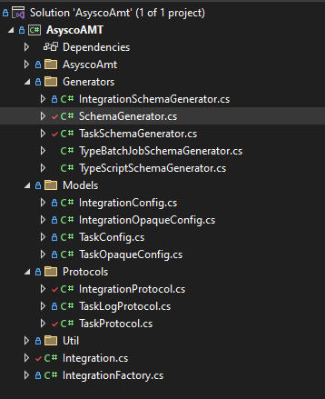

# Models

The models sections contains object definitions used by the implementation. It includes the opaque and config implementations. 



Create a folder **Models**.
In this folder create the **IntegrationConfig**, **IntegrationOpaqueConfig**, **TaskConfig** and **TaskOpaqueConfig** classes.

## OpaqueConfig
It should be understood that the implementation is stateless meaning no data is carried over when a task restarts or between task start and checking the status of a task.
OpaqueConfig provides a store that can be used to pass information between executions. The OpaqueConfig information is stored in the OpCon database as a json structure. 
There are two possible OpaqueConfig definitions, **IntegrationOpaqueConfig** for storing values passed to all tasks associated with the agent implementation such as security 
information and **TaskOpaqueConfig** for passing information between task method executions (StartTask, TaskStatus, DeleteTask) such as a job identifier. 

Create a folder **Models**.
In this folder create the **IntegrationOpaqueConfig** and the **TaskOpaqueConfig** classes.

```
using System;
using System.Collections.Generic;
using System.Linq;
using System.Text;
using System.Threading.Tasks;

namespace AsyscoAMT.Models;

public record IntegrationOpaqueConfig(string? AuthToken);

```
                   IntegrationOpaqueConfig.cs

The above snippet shows that an AuthToken has been persisted to the IntegrationOpaqueConfig structure. The value is then available to all tasks associated with the agent.

```
using System;
using System.Collections.Generic;
using System.Linq;
using System.Text;
using System.Threading.Tasks;

namespace AsyscoAMT.Models;

public record TaskOpaqueConfig(int? AdvancedSchemaGetCount, Guid? TaskId, String? Token, int? jobId, int? TestCntr);

```
                   IntegrationOpaqueConfig.cs

The above snippet shows the various values that are persisted to the TaskOpaqueConfig structure during a method execution of the task. These values are then available to all
subsequent TaskProtocol method executions of the same task.

## IntegrationConfig
This is a object that contains the agent definitions and allows for null checking to determine if a value is defined.

```
using Newtonsoft.Json.Linq;
using System;
using System.Collections.Generic;
using System.Linq;
using System.Text;
using System.Threading.Tasks;

namespace AsyscoAMT.Models;

public record IntegrationConfig
(
    string? url,
    string? apiUser,
    string? apiUserPassword
)
{
    public static IntegrationConfig? FromDynamic(dynamic config)
    {
        return config is JObject jObject
            ? jObject.ToObject<IntegrationConfig>()
            : (IntegrationConfig?)config;
    }
}

```
                   IntegrationConfig.cs

## TaskConfig
This is a object that contains the task definitions and allows for null checking to determine if a value is defined.

```
using System;
using System.Collections.Generic;
using System.Linq;
using System.Text;
using System.Threading.Tasks;

namespace AsyscoAMT.Models;

public record BatchServerJobs
(
    string? JobName = null,
    IEnumerable<string>? TaskValues = null
);

public record ScriptJobs
(
    string? ScriptName = null,
    IEnumerable<string>? ScriptParameters = null
);

public record TaskConfig
(
    string? ApplicationName = null,
    string? AmtUser = null,
    BatchServerJobs? BatchServerJobs = null,
    ScriptJobs? ScriptJobs = null
);

```
                   TaskConfig.cs
