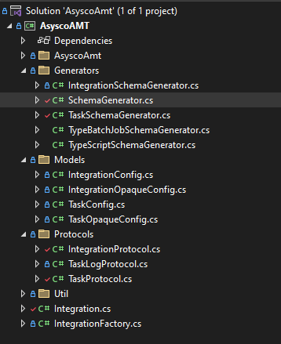

# Developing ACS Protocols

The protocol classes implement the link between the ACS environment and the remote system. Separate protocol classes must be created for managing the communications link, managing tasks and retrieving task logs. 



Create a folder **Protocols**.
In this folder create the **IntegrationProtocol**, **TaskLogProtocol** and **TaskProtocol** classes.

## IntegrationProtocol

The **IntegrationProtocol** class must implement the **IIntegrationProtocol** interface. The class constructor should include the **ILogger Logger** interface that writes log messages to the **SMAApiAgentNetcom.log** file in the SAM/Log directory. 

```

using ACSSDK.Interfaces;
using ACSSDK.Models;
using Microsoft.Extensions.Logging;
using Newtonsoft.Json;
using Newtonsoft.Json.Linq;
using System.Text.Json;
using System.Threading.Tasks;

namespace ACCTest.Protocols;

public class IntegrationProtocol(ILogger Logger) : IIntegrationProtocol
{

    public async Task<Result> InitialStatus(IConfig integrationConfig)
    {
        var url = integrationConfig?.Config?.apiUrl.ToString();
        var user = integrationConfig?.Config?.apiUser.ToString();
        var password = integrationConfig?.Config?.apiUserPassword.ToString();
        // var opaqueConfig = JsonConvert.DeserializeObject<IntegrationOpaqueConfig>(integrationConfig.OpaqueConfig ?? "{}") ?? new(null);

        if (string.IsNullOrEmpty(url) || string.IsNullOrEmpty(user) || string.IsNullOrEmpty(password))
        {
            Logger.LogCritical("Communication can not be established : Invalid Configuration");
            return new Result(ResultCode.NotCommunicating);
        }

        // dummy code for testing
        Logger.LogCritical("AsyscoAMT - Communications established");
        return Task.FromResult(new Result(ResultCode.Communicating));
        //        throw new NotImplementedException();
    }

    public Task<Result> Status(IConfig integrationConfig)
    {
        // dummy code for testing
        return Task.FromResult(new Result(ResultCode.Communicating));
        //        throw new NotImplementedException();
    }
}

```
                   IntegrationProtocol.cs 

The IntegrationProtocol class manages the connection between the ACS implementation and the remote system. After configuration has been completed and the ACS implementation is marked-up, the **InitialStatus** method is called to establish the connection to the remote system. If the connection is successfully established, a **Communicating** status is returned or if unsuccessful a **NotCommunicating** status is returned. If a **Communicating** status is returned, the ACS agent will be marked-up and it will be possible to submit task requests to the remote system.

Once the connection is established, the **Status** method is called on a regular basis to determine if the remote system is still available top process task requests. If available a **Communicating** status is returned, if not available a **NotCommunicating** status is returned and the ACS agent will be marked-down and no tasks can be started.    

The class must contain the **InitialStatus** and **Status** methods. In each case the methods accept the **IConfig** interface which provides the ACS agent configuration information.

The above code snippet is a dummy implementation allowing the ACS agent to start and remain active. The code also shows how the agent definition values can be retrieved.

The inclusion of **ILogger Logger** allows logging messages to be displayed in the SMAApiAgentNetcom.log file. 

## TaskProtocol

The **TaskProtocol** class must implement the **ITaskProtocol** interface. The class constructor should include the **IIntegration Intgration** and **ILogger Logger** interfaces that provides access to the agent information and that writes log messages to the **SMAApiAgentNetcom.log** file in the SAM/Log directory. 

```
using ACSSDK.Interfaces;
using ACSSDK.Models;
using AsyscoAMT.Models;
using Microsoft.Extensions.Logging;
using Newtonsoft.Json;
using System;
using System.Collections.Concurrent;
using System.Collections.Generic;
using System.Linq;
using System.Text;
using System.Threading.Tasks;

namespace AsyscoAMT.Protocols;

public class TaskProtocol(IIntegration Integration, ILogger Logger) : ITaskProtocol
{
    private readonly ConcurrentDictionary<string, TaskLog> _taskStatuses = new();

    public Task<TaskStatusEvent> CancelTask(ITaskConfig taskConfig)
    {
        throw new NotImplementedException();
    }

    public Task<TaskStatusEvent> DeleteTask(ITaskConfig taskConfig)
    {
        throw new NotImplementedException();
    }

    public Task<TaskStatusEvent> StartTask(ITaskConfig taskConfig)
    {
        var existingOpaque = JsonConvert.DeserializeObject<TaskOpaqueConfig>(taskConfig.OpaqueConfig ?? "{}") ?? new(0, default, null, 0, 0);
        var stConfig = JsonConvert.SerializeObject(taskConfig.Config);
        TaskConfig tConfig = JsonConvert.DeserializeObject<TaskConfig>(stConfig);

        var url = Integration.IntegrationInfo.Config.url;
        var user = Integration.IntegrationInfo.Config.apiUser;
        var password = Integration.IntegrationInfo.Config.apiUserPassword;

        var application = tConfig.ApplicationName;
        var jobName = tConfig.BatchServerJobs.JobName;

        // login

        //start task

        Logger.LogCritical($"StartTask : Url : {url} apiuser : {user} application {application} batch job {jobName}");

        taskConfig.Properties["Task Started?"] = "Yes";
        if (!taskConfig.ScopedProperties.TryGetValue("taskStartCount", out var startCount))
        {
            taskConfig.ScopedProperties["taskStartCount"] = "1";
        }
        else
        {
            taskConfig.ScopedProperties["taskStartCount"] = (int.Parse(startCount) + 1).ToString();
        }

        // create initial opaque config
        var newOpaque = existingOpaque with { TaskId = Guid.NewGuid(), Token = null, TestCntr = 0 };
        taskConfig.OpaqueConfig = JsonConvert.SerializeObject(newOpaque);
        var status = new TaskStatusEvent(TaskStatusCode.Running, null, "Running");
        return Task.FromResult(status);
    }

    public Task<TaskStatusEvent> TaskStatus(ITaskConfig taskConfig)
    {

        var url = Integration.IntegrationInfo.Config.url;
        var existingOpaque = JsonConvert.DeserializeObject<TaskOpaqueConfig>(taskConfig.OpaqueConfig);
        var stConfig = JsonConvert.SerializeObject(taskConfig.Config);
        TaskConfig tConfig = JsonConvert.DeserializeObject<TaskConfig>(stConfig);

        var taskId = GetTaskId(taskConfig);
        _taskStatuses.TryGetValue(taskId, out var log);
        var updates = log?.StatusUpdates;

        Logger.LogCritical($"TaskStatus : get status of job {tConfig.BatchServerJobs.JobName}");
        taskConfig.Properties["Task Status Events"] = updates?.Count().ToString() ?? "0";

        int cntr = (int)existingOpaque.TestCntr;
        Logger.LogCritical($"TaskStatus : Token : {existingOpaque.Token} cntr {cntr}");
        if (cntr < 5)
        {
            Logger.LogCritical($"TaskStatus - cntr {cntr} < 5");
            cntr++;
            var updateOpaque = existingOpaque with { TestCntr = cntr };
            taskConfig.OpaqueConfig = JsonConvert.SerializeObject(updateOpaque);
            var logEntry = updates?.LastOrDefault();
            var resultCode = logEntry?.Status ?? TaskStatusCode.Running;
            var result = new TaskStatusEvent(resultCode, null, logEntry?.Description ?? resultCode.ToString());
            return Task.FromResult(result);
        }
        else
        {
            Logger.LogCritical($"TaskStatus - cntr {cntr} > 5");
            var logEntry = updates?.LastOrDefault();
            var resultCode = logEntry?.Status ?? TaskStatusCode.Complete;
            var exitCode = logEntry?.ExitCode;
            var result = new TaskStatusEvent(resultCode, exitCode, logEntry?.Description ?? resultCode.ToString());
            return Task.FromResult(result);
        }
    }

    private static string GetTaskId(ITaskConfig taskConfig) => taskConfig.OpaqueConfig;

    private void UpdateTaskStatus(ITaskConfig taskConfig, TaskStatusEvent taskStatus)
    {
        var taskId = GetTaskId(taskConfig);

        if (!_taskStatuses.TryGetValue(taskId, out var taskLogStatus))
        {
            List<TaskStatusEvent> events = [taskStatus];
            _taskStatuses.TryAdd(taskId, new(events));
        }
        else
        {
            var previousUpdates = (List<TaskStatusEvent>)taskLogStatus.StatusUpdates;
            if (previousUpdates.Last().ExitCode != 2)
            {
                previousUpdates.Add(taskStatus);
            }
        }

        if (taskStatus.Status == TaskStatusCode.Complete)
        {
            Logger.LogCritical("UpdateTaskStatus - Before Config Update", taskConfig);
            taskConfig.Properties["Task Complete"] = "Yes";
            Logger.LogCritical("UpdateTaskStatus - After Config Update", taskConfig);
        }
    }
}

```
                   TaskProtocol.cs 

The above code snippet is dummy code that allows a task to start, log definition information of the agent and task and then complete after 5 TaskStatus cycles.
It shows how the cycle counter is passed between status checks using the TaskOpaqueConfig capability (see Models TaskConfigOpaque).

During a StartTask request, the TaskOpaqueConfig module is created for the task and persisted. Each task must have a unique id the Guid.NewGuid() function is used
to generate one. This is persisted in the TaskId of the TaskOpaqueConfiguration module.

The task definitions are saved in a TaskConfig object (see Models TaskConfig). The reason for this is to manage the task definitions to determine which values are present and
which values are not present. While it is possible to use the ITaskConfig interface to retrieve definition values, ITaskConfig consists of dynamic values and only contains the
values entered for the task definition. It contains no reference to null values. 

For each status check, the TaskOpaqueConfig is retrieved and the counter is checked and incremented and the TaskOpaqueConfig counter value is updated.  If the value is less than 5 and a **running** status is returned.
When the counter exceeds 5 a **Complete** message is returned.