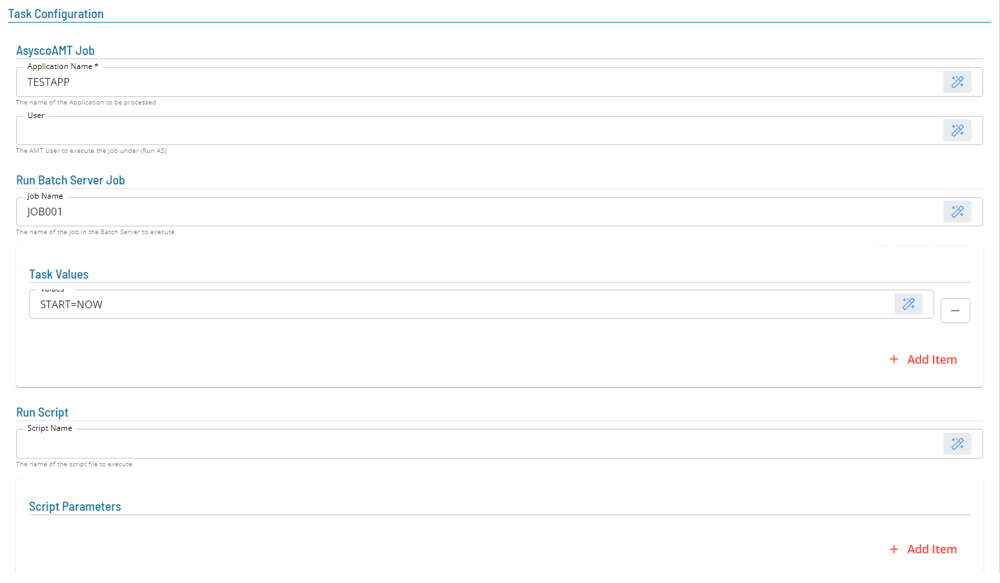

# Schema Definition

The configuration technology utilized by SMA products leverages the ReactJS library [`react-jsonschema-form`](https://github.com/rjsf-team/react-jsonschema-form) in order to dynamically generate configuration forms from [**JSON Schema**](https://json-schema.org/) objects. In order to do this, two JSON Schema objects are required - a `data` object which describes the shape and types of the configuration object and a `ui-schema` object which describes how the generated form should be rendered. Both objects must be provided by invocations of appropriate methods in the ISchemaGenerator implementation.

Create a folder **Generators**.
In this folder create the **SchemaGenerator**, **IntegrationSchemaGenerator**, **TaskSchemaProtocols** classes and the two **integration_schema.json** and **task_schema.json** files.


## SchemaGenerator

The SchemaGenerator class is used to call the SDK SchemaGenerator using the schema definitions of the agent and task definitions.

```
using System.Globalization;

namespace AsyscoAMT.Generators;


public class SchemaGenerator(IConfig Config, ILogger Logger) : ISchemaGenerator
{
    public Task<SchemaResult> GetIntegrationSchema(CultureInfo? locale = null) => Task.FromResult(IntegrationSchemaGenerator.Generate());

    public IEnumerable<string> GetSubTypes() => [TaskSchemaGenerator.JobName];

    public Task<SchemaResult> GetTaskSchemaForType(ITaskConfig taskConfig, CultureInfo? locale = null) => Task.FromResult(TaskSchemaGenerator.Generate(Config, taskConfig));
}
                
```
                    SchemaGenerator.cs 

The **SchemaGenerator** class must implement the **ISchemaGenerator** interface. The class constructor should include the **IConfig Config** and **ILogger Logger** interfaces.
The SchemaGenerator class references two schema classes (one for the ACS Agent definition and one for the ACS Agent Task definition).

The above implementation shows how it is possible to have multiple task subTypes (see ISchemaGenerator section of document architecture for more information). 
In the above code, the SchemaGenerator must reference both an IntegrationSchemaGenerator and a TaskSchemaGenerator. 

## IntegrationSchemaGenerator

The IntegrationSchemaGenerator class defines the fields required for the ACS agent definition. THe class constructor should include the **IIntegration Integration** interface.

```
using ACSSDK.Implementation;
using ACSSDK.Models;
using AsyscoAmt;
using AsyscoAMT.Util;
using Newtonsoft.Json;

namespace AsyscoAMT.Generators;

public static class IntegrationSchemaGenerator
{
    public static SchemaResult Generate()
    {
        var schema = new ObjectField("Asysco AMT");
        schema.AddProperty("url", new StringField("Batch Server URL", "AsyscoAMT Batch Server URL"), true);
        schema.AddProperty("apiUser", new StringField("API User", "AsyscoAMT API User"), true);
        schema.AddProperty("apiUserPassword", new StringField("API User Password", "AsyscoAMT API User password"), true);

        var settings = new JsonSerializerSettings() { NullValueHandling = NullValueHandling.Ignore };
        var schemaStr = JsonConvert.SerializeObject(schema, Formatting.None, settings);

        var uiSchema = new
        {
            url = new { },
            apiUser = new { },
            apiUserPassword = new { }
        };
        var uiSchemaStr = JsonConvert.SerializeObject(uiSchema, Formatting.None);

        var schemaBuilder = new SchemaResultBuilder(new(schemaStr, uiSchemaStr, "{}", false), IntegrationFactory.AppName);
        return schemaBuilder.Build();

    }
}

```
                    IntegrationSchemaGenerator.cs 


In the above code snippet, three fields are defined consisting url, apiUser and apiUserPassword fields which are all required fields.
The above schema definition adds fields to the Solution Manager agent definition section.

The code snippet below is the integration_schema.json file which shows the schema definition.

```
{
  "type": "object",
  "properties": {
    "url": {
      "type": "string",
      "title": "Batch Server URL",
      "description": "AsyscoAMT Batch Server URL"
    },
    "apiUser": {
      "type": "string",
      "title": "API User",
      "description": "AsyscoAMT API User"
    },
    "apiUserPassword": {
      "type": "string",
      "title": "API User Password",
      "description": "AsyscoAMT API User Password"
    }
  },
  "required": [
    "url",
    "apiUser",
    "apiUserPassword"
  ],
  "title": "AsyscoAMT"
}

```
                    integration_schema.json 


## TaskSchemaGenerator

The TaskSchemaGenerator class defines the fields required for the AsyscoAMT Task definition. The class constructor should include the **IConfig integrationConfig** and 
**ITaskConfig taskConfig** interfaces.

It includes a Generate method called by the SchemaGenerator class.

The Task definition screen is broken into three sections, the first section general arguments and the next two sections are used depending if a run job or a run script 
is being defined. Each section is defined by creating an ObjectField that groups the arguments.  

```
using ACSSDK.Implementation;
using ACSSDK.Interfaces;
using ACSSDK.Models;
using AsyscoAmt;
using AsyscoAMT.Util;
using Newtonsoft.Json;
using System;
using System.Collections.Generic;
using System.Linq;
using System.Text;
using System.Threading.Tasks;

namespace AsyscoAMT.Generators;

public static class TaskSchemaGenerator
{
    public const string JobName = "AsyscoAMT Job";

    public static SchemaResult Generate(IConfig integrationConfig, ITaskConfig taskConfig)
    {
        var schema = GetDataSchema(integrationConfig, taskConfig);
        var settings = new JsonSerializerSettings() { NullValueHandling = NullValueHandling.Ignore };
        var schemaStr = JsonConvert.SerializeObject(schema, Formatting.None, settings);
        var uiSchemaStr = GetUiSchema(taskConfig);

        var schemaBuilder = new SchemaResultBuilder(new(schemaStr, uiSchemaStr, "{}", false), IntegrationFactory.AppName);
        return schemaBuilder.Build();
    }
    private static ObjectField GetDataSchema(IConfig integrationConfig, ITaskConfig taskConfig)
    {

        var schema = new ObjectField(JobName);

        schema.AddProperty("applicationName", new StringField("Application Name", "The name of the Application to be processed"), true);
        schema.AddProperty("amtUser", new StringField("User", "The AMT User to execute the job under (Run AS)"), false);
        schema.AddProperty("batchServerJobs", GetRunBatchServerJobs());
        schema.AddProperty("scriptJobs", GetRunScriptJobs());

        return schema;

    }

    private static ObjectField GetRunBatchServerJobs()
    {
        var config = new ObjectField("Run Batch Server Job");
        config.AddProperty("jobName", new StringField("Job Name", "The name of the Job in the Batch Server to execute"), false);
        config.AddProperty("taskValues", new ArrayField("Task Values", new StringField("Values")).WithMaxItems(20));
        return config;
    }

    private static ObjectField GetRunScriptJobs()
    {
        var config = new ObjectField("Run Script");
        config.AddProperty("scriptName", new StringField("Script Name", "The name of the script file to execute"), false);
        config.AddProperty("scriptParameters", new ArrayField("Script Parameters", new StringField("Parameter")).WithMaxItems(20));
        return config;
    }
    private static string GetUiSchema(ITaskConfig config)
    {
        var autoPopulate = config.Config.autoPopulate;
        var disableAutoPopulated = autoPopulate is not null && (bool)autoPopulate.useAutoPopulate && (bool)autoPopulate.useAutoOverWrite;

        var uiSchema = new Dictionary<string, dynamic>
        {
            ["ui:order"] = new List<string>
            {
                "applicationName", // required
                "amtUser", 
                "batchServerJobs", 
                "scriptJobs"
            }
        };

        var uiSchemaStr = JsonConvert.SerializeObject(uiSchema, Formatting.None);
        return uiSchemaStr;
    }

}

```
                    TaskSchemaGenerator.cs 

The task_schema.json file contains additional information about the TaskSchema.

```
{
  "type": "object",
  "properties": {
    "applicationName": {
      "type": "string",
      "title": "Application Name",
      "description": "The name of the Application to be processed"
    },
    "amtUser": {
      "type": "string",
      "title": "User",
      "description": "The AMT User to execute the job under (Run AS)"
    },
    "batchServerJobs": {
      "type": "object",
      "properties": {
        "jobName": {
          "type": "string",
          "title": "Job Name",
          "description": "The name of the Job in the Batch Server to execute"
        },
        "taskValues": {
          "type": "array",
          "title": "Task Values",
          "maxItems": 20,
          "items": {
            "type": "string",
            "title": "Values"
          }
        }
      },
      "title": "Run Batch Server Job"
    },
    "scriptJobs": {
      "type": "object",
      "properties": {
        "scriptName": {
          "type": "string",
          "title": "Script Name",
          "description": "The name of the script file to execute"
        },
        "scriptParameters": {
          "type": "array",
          "title": "Script Parameters",
          "maxItems": 20,
          "items": {
            "type": "string",
            "title": "Parameters"
          }
        }
      }
    },
    "title": "Run Script",
  }
  "required": [
      "applicationName"
    ],
    "title": "AsyscoAMT"
  }

```
                    task_schema.json 



## SchemaGeneratorUtils
This is a utility class contained in the **Util** directory and contains various methods to assist with schema generatio.

```
using Newtonsoft.Json.Serialization;
using Newtonsoft.Json;

namespace AsyscoAMT.Util;

[JsonObject(NamingStrategyType = typeof(CamelCaseNamingStrategy))]
public class ObjectField(string? Title = null, string? Description = null)
{
    public string? Title { get; init; } = Title;
    public string? Description { get; init; } = Description;
    public string Type = "object";
    public Dictionary<string, dynamic> Properties = [];
    public List<string> Required = [];
    public Dictionary<string, dynamic> Definitions = [];
    public List<dynamic> AllOf = [];

    public void AddProperty(string key, dynamic value, bool required = false)
    {
        Properties.Add(key, value);
        if (required) Required.Add(key);
    }

    public ObjectField WithConditional<T>(string propertyName, T propertyValue, ObjectField ifTrue)
    {
        var condition = new Condition<T>(propertyValue);
        var conditionClause = new ConditionClause<T>(new() { { propertyName, condition } });
        AllOf.Add(new AllOfConditional<T>(conditionClause, ifTrue));
        return this;
    }

    public ObjectField WithDefinition(string name, dynamic definition)
    {
        Definitions.Add(name, definition);
        return this;
    }

    public bool ShouldSerializeProperties() => Properties.Count > 0;
    public bool ShouldSerializeRequired() => Required.Count > 0;
    public bool ShouldSerializeDefinitions() => Definitions.Count > 0;
    public bool ShouldSerializeAllOf() => AllOf.Count > 0;
}

[JsonObject(NamingStrategyType = typeof(CamelCaseNamingStrategy))]
public class ArrayField(string Title, dynamic ItemTemplate, string? Description = null)
{
    public string Title { get; init; } = Title;
    public string? Description { get; init; } = Description;
    public string Type = "array";
    public int? MaxItems { get; set; } = null;
    public dynamic Items { get; init; } = ItemTemplate;
    public bool? UniqueItems { get; set; }

    public ArrayField WithMaxItems(int count)
    {
        MaxItems = count;
        return this;
    }

    public ArrayField WithUniqueItems(bool uniqueItems = true)
    {
        UniqueItems = uniqueItems;
        return this;
    }
}

[JsonObject(NamingStrategyType = typeof(CamelCaseNamingStrategy))]
public class NullField(string? Title, string? Description = null)
{
    public string? Title { get; init; } = Title;
    public string? Description { get; init; } = Description;
    public string Type = "null";
}

[JsonObject(NamingStrategyType = typeof(CamelCaseNamingStrategy))]
public class StringField(string Title, string? Description = null)
{
    public string Title { get; init; } = Title;
    public string? Description { get; init; } = Description;
    public string Type = "string";
    public int? MaxLength { get; set; } = null;
    public int? MinLength { get; set; } = null;

    public StringField WithMaxLength(int len)
    {
        MaxLength = len;
        return this;
    }

    public StringField WithMinLength(int len)
    {
        MinLength = len;
        return this;
    }
}

[JsonObject(NamingStrategyType = typeof(CamelCaseNamingStrategy))]
public class IntField(string Title, string? Description = null)
{
    public string Title { get; init; } = Title;
    public string? Description { get; init; } = Description;
    public string Type = "integer";
    public int? Maximum { get; set; } = null;
    public int? Minimum { get; set; } = null;
    public int? Default { get; set; } = null;

    public IntField WithMax(int val)
    {
        Maximum = val;
        return this;
    }

    public IntField WithMin(int val)
    {
        Minimum = val;
        return this;
    }

    public IntField WithDefault(int val)
    {
        Default = val;
        return this;
    }
}

[JsonObject(NamingStrategyType = typeof(CamelCaseNamingStrategy))]
public class BoolField(string Title, string? Description = null)
{
    public string Title { get; init; } = Title;
    public string? Description { get; init; } = Description;
    public string Type = "boolean";
    public bool Default { get; set; } = false;

    public BoolField WithDefault(bool val)
    {
        Default = val;
        return this;
    }
}

[JsonObject(NamingStrategyType = typeof(CamelCaseNamingStrategy))]
public class RefField(string Title, string Ref)
{
    public string Title { get; init; } = Title;

    [JsonProperty("$ref")]
    public string Ref { get; init; } = Ref;
}

[JsonObject(NamingStrategyType = typeof(CamelCaseNamingStrategy))]
public class EnumEntry(string Entry, string Type)
{
    public string Type = Type;
    public string Title = Entry;
    public List<string> Enum = [Entry];
}

[JsonObject(NamingStrategyType = typeof(CamelCaseNamingStrategy))]
public class EnumField(string Title, string Type, IEnumerable<string> Values)
{

    public string Title { get; init; } = Title;

    public string Type { get; init; } = Type;

    public string Default { get; init; } = Values.FirstOrDefault(string.Empty);

    public IEnumerable<EnumEntry> AnyOf { get; init; } = Values.Select(v => new EnumEntry(v, Type));
}

public class Condition<T>(T value)
{
    public T Const { get; init; } = value;
}

public class ConditionClause<T>(Dictionary<string, Condition<T>> Properties)
{
    public Dictionary<string, Condition<T>> Properties { get; init; } = Properties;
}

[JsonObject(NamingStrategyType = typeof(CamelCaseNamingStrategy))]
public class AllOfConditional<T>(ConditionClause<T> If, ObjectField Then)
{

    public ConditionClause<T> If { get; init; } = If;
    public ObjectField Then { get; init; } = Then;
}

[JsonObject(NamingStrategyType = typeof(CamelCaseNamingStrategy))]
public class ObjectEnumEntry<T>(Func<T, string> getNameFunc, IEnumerable<T> options)
{
    public IEnumerable<string> EnumNames { get; set; } = options.Select(getNameFunc).ToList();
    public IEnumerable<T> Enum { get; set; } = options;
}

[JsonObject(NamingStrategyType = typeof(CamelCaseNamingStrategy))]
public class ObjectEnumField<T>(string? title, Func<T, string> getNameFunc, IEnumerable<T> options)
{
    public string? Title { get; set; } = title;
    public string Type { get; } = "array";
    public bool UniqueItems { get; } = true;
    public ObjectEnumEntry<T> Items { get; } = new(getNameFunc, options);
}

```
                    SchemaGeneratorUtils.cs 