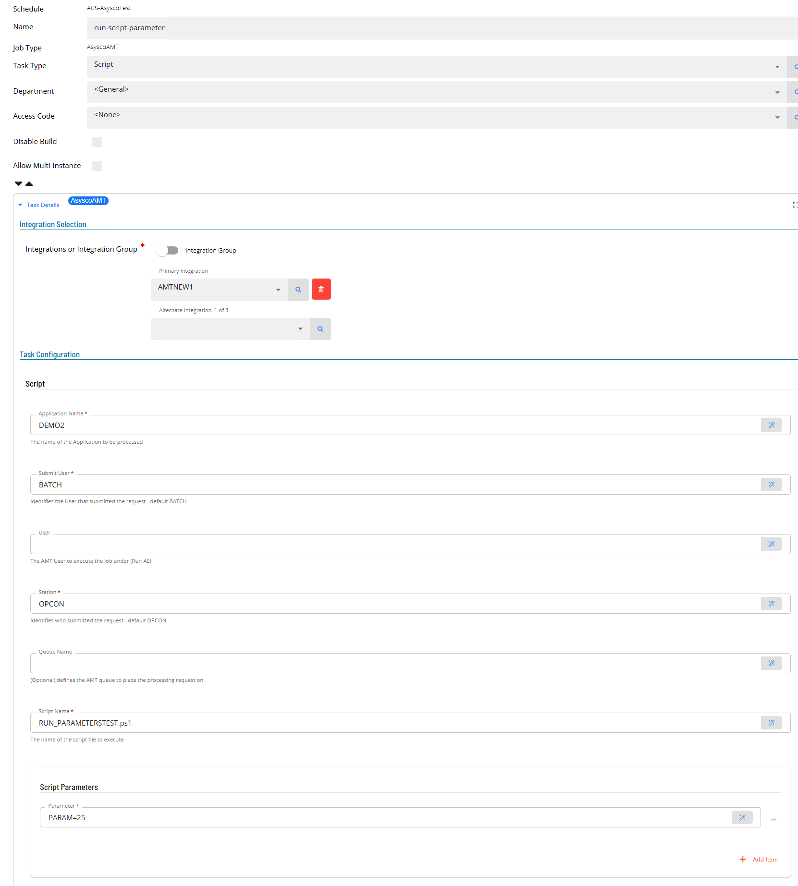

# Schema Definition

The configuration technology utilized by SMA products leverages the ReactJS library [`react-jsonschema-form`](https://github.com/rjsf-team/react-jsonschema-form) in order to dynamically generate configuration forms from [**JSON Schema**](https://json-schema.org/) objects. In order to do this, two JSON Schema objects are required - a `data` object which describes the shape and types of the configuration object and a `ui-schema` object which describes how the generated form should be rendered. Both objects must be provided by invocations of appropriate methods in the ISchemaGenerator implementation.

In general when defining the schema information, all information required to complete a connection to the remote system should be defined within the IntegrationSchemaGenerator while information about executing a task should be defined within the TaskSchemaGenerator. In the AsyscoAMT implementation, the connection information base url, connection user and password are defined within the IntegrationSchemaGenerator module. 

Create a folder **Generators**.
In this folder create the **SchemaGenerator**, **IntegrationSchemaGenerator**, **TaskSchemaProtocols**, **TypeBatchJobSchemaGenerator** and **TypeScriptSchemaGenerator** classes.


## SchemaGenerator

The SchemaGenerator class is used to call the SDK SchemaGenerator using the schema definitions of the agent and task definitions.

```
using System.Globalization;

namespace AsyscoAMT.Generators;


public class SchemaGenerator(IConfig Config, ILogger Logger) : ISchemaGenerator
{
    public Task<SchemaResult> GetIntegrationSchema(CultureInfo? locale = null) => Task.FromResult(IntegrationSchemaGenerator.Generate());

   public IEnumerable<string> GetSubTypes() => TaskSchemaGenerator.Types;

   public Task<SchemaResult> GetTaskSchemaForType(ITaskConfig taskConfig, CultureInfo? locale = null)
   {
       return TaskSchemaGenerator.GetTaskSchemaForType(taskConfig);
   }
}
                
```
The **SchemaGenerator** class must implement the **ISchemaGenerator** interface. The class constructor should include the **IConfig Config** and **ILogger Logger** interfaces.
The SchemaGenerator class references two schema classes (one for the ACS Agent definition and one for the ACS Agent Task definition).

The above implementation shows how it is possible to have multiple task subTypes (see ISchemaGenerator section of document architecture for more information). 
In the above code, a reference is made to ***TaskSchemaGeneratorTypes*** which is a list of subtypes that the implementation supports. 
The code also provides a reference to both the created IntegrationSchemaGenerator and the TaskSchemaGenerator. 

## IntegrationSchemaGenerator

The IntegrationSchemaGenerator class defines the fields required for the ACS agent definition. THe class constructor should include the **IIntegration Integration** interface.

```
using ACSSDK.Implementation;
using ACSSDK.Models;
using AsyscoAmt;
using AsyscoAMT.Util;
using Newtonsoft.Json;

namespace AsyscoAMT.Generators;

public static class IntegrationSchemaGenerator
{
    public static SchemaResult Generate()
    {
        var schema = new ObjectField("Asysco AMT");
        schema.AddProperty("url", new StringField("Batch Server URL", "AsyscoAMT Batch Server URL"), true);
        schema.AddProperty("apiUser", new StringField("API User", "AsyscoAMT API User"), true);
        schema.AddProperty("apiUserPassword", new StringField("API User Password", "AsyscoAMT API User password"), true);

        var settings = new JsonSerializerSettings() { NullValueHandling = NullValueHandling.Ignore };
        var schemaStr = JsonConvert.SerializeObject(schema, Formatting.None, settings);

        var uiSchema = new
        {
            url = new { },
            apiUser = new { },
            apiUserPassword = new { }
        };
        var uiSchemaStr = JsonConvert.SerializeObject(uiSchema, Formatting.None);

        var schemaBuilder = new SchemaResultBuilder(new(schemaStr, uiSchemaStr, "{}", false), IntegrationFactory.AppName);
        return schemaBuilder.Build();

    }
}

```

In the above code snippet, three fields are defined consisting url, apiUser and apiUserPassword fields which are all required fields.
The above schema definition adds fields to the Solution Manager agent definition section.


## TaskSchemaGenerator

The TaskSchemaGenerator class defines the fields required for the AsyscoAMT Task definitions. The class constructor should include the **IConfig integrationConfig** and 
**ITaskConfig taskConfig** interfaces.

It includes the ***GetTaskSchemaForType*** method called by the SchemaGenerator class.

The Task definition screen is broken into three sections, the first section general arguments and the next two sections are used depending if a run job or a run script 
is being defined. Each section is defined by creating an ObjectField that groups the arguments.  

```
using ACSSDK.Implementation;
using ACSSDK.Interfaces;
using ACSSDK.Models;
using AsyscoAmt;
using AsyscoAMT.Util;
using Newtonsoft.Json;
using System;
using System.Collections.Generic;
using System.Linq;
using System.Text;
using System.Threading.Tasks;

namespace AsyscoAMT.Generators;

public static class TaskSchemaGenerator
{

    private const string BatchJobType = "Batch Job";
    private const string ScriptType = "Script";

    public static readonly string[] Types = [BatchJobType, ScriptType];

    public static Task<SchemaResult> GetTaskSchemaForType(ITaskConfig taskConfig)
    {
        var schema = taskConfig.TaskType switch
        {
            BatchJobType => TypeBatchJobSchemaGenerator.Generate(taskConfig),
            ScriptType => TypeScriptSchemaGenerator.Generate(taskConfig),
            _ => new("{}", "{}", "{}", true)

        };

        return Task.FromResult(schema);
    }
}

```
The TaskSchemaGenerator includes a reference for each defined subtypes. 
In the above code there are two subtypes **BatchJobType** and **ScriptType**.
Each module is called in sequence to generate the schema for the task definition requirements.

The module TypeBatchJobSchemaGenerator includes the task definitions for an AsyscoAMT Batch Job.


```
using ACSSDK.Implementation;
using ACSSDK.Interfaces;
using ACSSDK.Models;
using AsyscoAmt;
using AsyscoAMT.Util;
using Newtonsoft.Json;
using System;
using System.Collections.Generic;
using System.Linq;
using System.Text;
using System.Threading.Tasks;

namespace AsyscoAMT.Generators;

public static class TypeBatchJobSchemaGenerator
{

    public const string JobType = "Batch Job";

    public static SchemaResult Generate(ITaskConfig taskConfig)
    {
        var schema = GetDataSchema(taskConfig);
        var settings = new JsonSerializerSettings() { NullValueHandling = NullValueHandling.Ignore };
        var schemaStr = JsonConvert.SerializeObject(schema, Formatting.None, settings);
        var uiSchemaStr = GetUiSchema(taskConfig);

        var schemaBuilder = new SchemaResultBuilder(new(schemaStr, uiSchemaStr, "{}", false), IntegrationFactory.AppName);
        return schemaBuilder.Build();
    }
    private static ObjectField GetDataSchema(ITaskConfig taskConfig)
    {

        var schema = new ObjectField(JobType);

        schema.AddProperty("applicationName", new StringField("Application Name", "The name of the Application to be processed"), true);
        schema.AddProperty("amtSubmitUser", new StringField("Submit User", "Identifies the User that submitted the request - default BATCH").WithDefault("BATCH"), true);
        schema.AddProperty("amtUser", new StringField("User", "The AMT User to execute the job under (Run AS)"), false);
        schema.AddProperty("amtStation", new StringField("Station", "Identifies who submitted the request - default OPCON").WithDefault("OPCON"), true);
        schema.AddProperty("amtQueueName", new StringField("Queue Name", "(Optional) defines the AMT queue to place the processing request on"), false);
        schema.AddProperty("jobName", new StringField("Job Name", "The name of the Job in the Batch Server to execute"), true);
        schema.AddProperty("taskValues", new ArrayField("Task Values", new StringField("Values")).WithMaxItems(20));

        return schema;

    }

    private static string GetUiSchema(ITaskConfig config)
    {
        var autoPopulate = config.Config.autoPopulate;
        var disableAutoPopulated = autoPopulate is not null && (bool)autoPopulate.useAutoPopulate && (bool)autoPopulate.useAutoOverWrite;

        var uiSchema = new Dictionary<string, dynamic>
        {
            ["ui:order"] = new List<string>
            {
                "applicationName", // required
                "amtSubmitUser", // required
                "amtUser",
                "amtStation", // required
                "amtQueueName",
                "jobName", // required
                "taskValues"
            }
        };

        var uiSchemaStr = JsonConvert.SerializeObject(uiSchema, Formatting.None);
        return uiSchemaStr;
    }

}

```
The above codes shows how to implement a list for the **taskValues** 

The module TypeScriptSchemaGenerator includes the task definitions for an AsyscoAMT Batch Job.



```
using ACSSDK.Implementation;
using ACSSDK.Interfaces;
using ACSSDK.Models;
using AsyscoAMT.Util;
using AsyscoAmt;
using Newtonsoft.Json;
using System;
using System.Collections.Generic;
using System.Linq;
using System.Text;
using System.Threading.Tasks;

namespace AsyscoAMT.Generators;

public static class TypeScriptSchemaGenerator
{
    public const string JobType = "Script";

    public static SchemaResult Generate(ITaskConfig taskConfig)
    {
        var schema = GetDataSchema(taskConfig);
        var settings = new JsonSerializerSettings() { NullValueHandling = NullValueHandling.Ignore };
        var schemaStr = JsonConvert.SerializeObject(schema, Formatting.None, settings);
        var uiSchemaStr = GetUiSchema(taskConfig);

        var schemaBuilder = new SchemaResultBuilder(new(schemaStr, uiSchemaStr, "{}", false), IntegrationFactory.AppName);
        return schemaBuilder.Build();
    }
    private static ObjectField GetDataSchema(ITaskConfig taskConfig)
    {

        var schema = new ObjectField(JobType);

        schema.AddProperty("applicationName", new StringField("Application Name", "The name of the Application to be processed"), true);
        schema.AddProperty("amtSubmitUser", new StringField("Submit User", "Identifies the User that submitted the request - default BATCH").WithDefault("BATCH"), true);
        schema.AddProperty("amtUser", new StringField("User", "The AMT User to execute the job under (Run AS)"), false);
        schema.AddProperty("amtStation", new StringField("Station", "Identifies who submitted the request - default OPCON").WithDefault("OPCON"), true);
        schema.AddProperty("amtQueueName", new StringField("Queue Name", "(Optional) defines the AMT queue to place the processing request on"), false);
        schema.AddProperty("scriptName", new StringField("Script Name", "The name of the script file to execute"), true);
        schema.AddProperty("scriptParameters", new ArrayField("Script Parameters", new StringField("Parameter")).WithMaxItems(20));

        return schema;

    }

    private static string GetUiSchema(ITaskConfig config)
    {
        var autoPopulate = config.Config.autoPopulate;
        var disableAutoPopulated = autoPopulate is not null && (bool)autoPopulate.useAutoPopulate && (bool)autoPopulate.useAutoOverWrite;

        var uiSchema = new Dictionary<string, dynamic>
        {
            ["ui:order"] = new List<string>
            {
                "applicationName", // required
                "amtSubmitUser", // required
                "amtUser",
                "amtStation", // required
                "amtQueueName",
                "scriptName", // required
                "scriptParameters"
            }
        };

        var uiSchemaStr = JsonConvert.SerializeObject(uiSchema, Formatting.None);
        return uiSchemaStr;
    }

}

```
The above code shows how to implement a list for the **ScriptParameters** 

## Exit Code Failure Criteria

The **SchemaResultBuilder** class provides the **WithExitCodeFailureCriteria** method that adds an Exit Code Failure Criteria field to task definitions. This feature allows users to define custom rules for determining whether a task succeeded or failed based on its exit code. This is particularly useful when integrating with external systems where non-zero exit codes may indicate success, or when specific exit code ranges have special meanings.

### Adding Exit Code Criteria to Your Schema

To enable exit code failure criteria in your task schema, chain the `.WithExitCodeFailureCriteria()` method to the SchemaResultBuilder before calling `.Build()`:

```
using ACSSDK.Implementation;
using ACSSDK.Interfaces;
using ACSSDK.Models;
using AsyscoAmt;
using AsyscoAMT.Util;
using Newtonsoft.Json;

namespace AsyscoAMT.Generators;

public static class TypeBatchJobSchemaGenerator
{
    public const string JobType = "Batch Job";

    public static SchemaResult Generate(ITaskConfig taskConfig)
    {
        var schema = GetDataSchema(taskConfig);
        var settings = new JsonSerializerSettings() { NullValueHandling = NullValueHandling.Ignore };
        var schemaStr = JsonConvert.SerializeObject(schema, Formatting.None, settings);
        var uiSchemaStr = GetUiSchema(taskConfig);

        var schemaBuilder = new SchemaResultBuilder(new(schemaStr, uiSchemaStr, "{}", false), IntegrationFactory.AppName);
        return schemaBuilder.WithExitCodeFailureCriteria().Build();
    }
}
```

The above code shows how to add the exit code failure criteria field to a task schema by calling `.WithExitCodeFailureCriteria()` before `.Build()`. This adds a specialized field to the task definition screen where users can configure exit code evaluation rules.

### Available Operators

The exit code failure criteria supports the following comparison operators:

- **EQ** (=) - Equals
- **NE** (≠) - Not equals  
- **GT** (>) - Greater than
- **LT** (<) - Less than
- **GE** (≥) - Greater than or equal
- **LE** (≤) - Less than or equal
- **RG** - Range (requires both a starting value and ending value)

Multiple criteria can be combined using **AND** or **OR** boolean operators to create complex evaluation rules.

### Default Behavior

If the exit code failure criteria field is added to a task schema but no custom criteria are configured by the user, the default behavior is:
- Exit code **≠ 0** results in **Fail**
- Exit code **= 0** results in **Finish OK**

### Criteria Configuration Structure

The exit code failure criteria are stored in the task configuration as an array under the property name `#opconExitCodeCriteria`. Each criterion in the array is an object with the following structure:

**Required Fields:**
- **operator** - An object containing:
  - **value** - The operator code (EQ, NE, GT, LT, GE, LE, RG)
  - **sign** - The visual symbol (=, ≠, >, <, ≥, ≤)
- **value** - The integer value to compare against
- **result** - The outcome if the condition is met: "Fail" or "Finish OK"

**Optional Fields:**
- **endValue** - Required only for Range (RG) operators, specifies the upper bound of the range
- **booleanOperator** - Used to combine multiple criteria: "AND" or "OR"

The configuration must contain at least one criterion (minItems: 1).

### Using ExitCodeCriteria in TaskProtocol

In the **TaskProtocol** implementation, use the static helper method **ExitCodeCriteria.TaskStatusCodeFromExitCode** to evaluate whether a task finished successfully based on the configured criteria:

```
using ACSSDK.Interfaces;
using ACSSDK.Models;
using ACSSDK.SchemaDefinitions;
using AsyscoAMT.Models;
using Microsoft.Extensions.Logging;
using Newtonsoft.Json;

namespace AsyscoAMT.Protocols;

public class TaskProtocol(IIntegration Integration, ILogger Logger) : ITaskProtocol
{
    public Task<TaskStatusEvent> TaskStatus(ITaskConfig taskConfig)
    {
        var url = Integration.IntegrationInfo.Config.url;
        var existingOpaque = JsonConvert.DeserializeObject<TaskOpaqueConfig>(taskConfig.OpaqueConfig);
        var stConfig = JsonConvert.SerializeObject(taskConfig.Config);
        TaskConfig tConfig = JsonConvert.DeserializeObject<TaskConfig>(stConfig);

        var taskId = GetTaskId(taskConfig);
        
        // Retrieve the exit code from the external system
        int exitCode = GetTaskExitCodeFromExternalSystem(url, taskId, tConfig);
        
        // Evaluate the exit code against the configured failure criteria
        var taskStatusCode = ExitCodeCriteria.TaskStatusCodeFromExitCode(exitCode, taskConfig);
        
        Logger.LogInformation($"Task {taskId} completed with exit code {exitCode}, status: {taskStatusCode}");
        
        return Task.FromResult(new TaskStatusEvent(taskStatusCode, exitCode, "Complete"));
    }
}
```

The **ExitCodeCriteria.TaskStatusCodeFromExitCode(exitCode, taskConfig)** method is the primary method for evaluating exit codes. It takes the following parameters:
- **exitCode** (int) - The integer exit code returned by the external system
- **taskConfig** (ITaskConfig) - The ITaskConfig object containing the user-configured failure criteria
- **criteriaPropName** (string, optional) - The property name where the criteria are stored. Defaults to `ExitCodeCriteria.Name` ("#opconExitCodeCriteria")

The method evaluates the exit code against the criteria configured in the task definition and returns either **TaskStatusCode.Complete** or **TaskStatusCode.Failed**. The exit code value should then be passed as the second parameter to **TaskStatusEvent** so it is visible in OpCon job details.

**Method Signature:**
```
public static TaskStatusCode TaskStatusCodeFromExitCode(
    int exitCode, 
    ITaskConfig configWithCriteria, 
    string criteriaPropName = ExitCodeCriteria.Name
)
```

Most implementations use the default property name and only need to pass the first two parameters.

### Alternative Evaluation Method

If you need a boolean result instead of a TaskStatusCode, you can use the **DoesExitCodeFulfillCriteria** method:

```
bool isSuccess = ExitCodeCriteria.DoesExitCodeFulfillCriteria(exitCode, taskConfig);
```

This method has the same parameters as **TaskStatusCodeFromExitCode**:
- **exitCode** (int) - The integer exit code to evaluate
- **taskConfig** (ITaskConfig) - The ITaskConfig object containing the configured failure criteria
- **criteriaPropName** (string, optional) - The property name where the criteria are stored. Defaults to `ExitCodeCriteria.Name`

The method returns **true** if the exit code should be considered successful (Finish OK), **false** if it should be considered a failure.

### Example Usage Scenarios

**Scenario 1: Success on exit codes 0-4**  
Configure a range operator where exit codes 0 through 4 result in "Finish OK", while all other exit codes result in "Fail".
- Operator: **RG** (Range)
- Value: 0
- End Value: 4
- Result: Finish OK

**Scenario 2: Specific success codes**  
Use multiple criteria combined with OR operators to specify that exit codes 0, 2, and 100 all indicate success.
- Criteria 1: Operator **EQ**, Value: 0, Result: Finish OK, Boolean: OR
- Criteria 2: Operator **EQ**, Value: 2, Result: Finish OK, Boolean: OR  
- Criteria 3: Operator **EQ**, Value: 100, Result: Finish OK

**Scenario 3: Complex failure conditions**  
Configure criteria where exit codes less than 0 or greater than 10 indicate failure.
- Criteria 1: Operator **LT**, Value: 0, Result: Fail, Boolean: OR
- Criteria 2: Operator **GT**, Value: 10, Result: Fail

## SchemaGeneratorUtils
This is a utility class contained in the **Util** directory and contains various methods to assist with schema generatio.

```
using Newtonsoft.Json.Serialization;
using Newtonsoft.Json;

namespace AsyscoAMT.Util;

[JsonObject(NamingStrategyType = typeof(CamelCaseNamingStrategy))]
public class ObjectField(string? Title = null, string? Description = null)
{
    public string? Title { get; init; } = Title;
    public string? Description { get; init; } = Description;
    public string Type = "object";
    public Dictionary<string, dynamic> Properties = [];
    public List<string> Required = [];
    public Dictionary<string, dynamic> Definitions = [];
    public List<dynamic> AllOf = [];

    public void AddProperty(string key, dynamic value, bool required = false)
    {
        Properties.Add(key, value);
        if (required) Required.Add(key);
    }

    public ObjectField WithConditional<T>(string propertyName, T propertyValue, ObjectField ifTrue)
    {
        var condition = new Condition<T>(propertyValue);
        var conditionClause = new ConditionClause<T>(new() { { propertyName, condition } });
        AllOf.Add(new AllOfConditional<T>(conditionClause, ifTrue));
        return this;
    }

    public ObjectField WithDefinition(string name, dynamic definition)
    {
        Definitions.Add(name, definition);
        return this;
    }

    public bool ShouldSerializeProperties() => Properties.Count > 0;
    public bool ShouldSerializeRequired() => Required.Count > 0;
    public bool ShouldSerializeDefinitions() => Definitions.Count > 0;
    public bool ShouldSerializeAllOf() => AllOf.Count > 0;
}

[JsonObject(NamingStrategyType = typeof(CamelCaseNamingStrategy))]
public class ArrayField(string Title, dynamic ItemTemplate, string? Description = null)
{
    public string Title { get; init; } = Title;
    public string? Description { get; init; } = Description;
    public string Type = "array";
    public int? MaxItems { get; set; } = null;
    public dynamic Items { get; init; } = ItemTemplate;
    public bool? UniqueItems { get; set; }

    public ArrayField WithMaxItems(int count)
    {
        MaxItems = count;
        return this;
    }

    public ArrayField WithUniqueItems(bool uniqueItems = true)
    {
        UniqueItems = uniqueItems;
        return this;
    }
}

[JsonObject(NamingStrategyType = typeof(CamelCaseNamingStrategy))]
public class NullField(string? Title, string? Description = null)
{
    public string? Title { get; init; } = Title;
    public string? Description { get; init; } = Description;
    public string Type = "null";
}

[JsonObject(NamingStrategyType = typeof(CamelCaseNamingStrategy))]
public class StringField(string Title, string? Description = null)
{
    public string Title { get; init; } = Title;
    public string? Description { get; init; } = Description;
    public string Type = "string";
    public int? MaxLength { get; set; } = null;
    public int? MinLength { get; set; } = null;
    public string Default { get; set; } = null;

    public StringField WithMaxLength(int len)
    {
        MaxLength = len;
        return this;
    }

    public StringField WithMinLength(int len)
    {
        MinLength = len;
        return this;
    }

    public StringField WithDefault(string defaultValue)
    {
        Default = defaultValue;
        return this;
    }
}

[JsonObject(NamingStrategyType = typeof(CamelCaseNamingStrategy))]
public class IntField(string Title, string? Description = null)
{
    public string Title { get; init; } = Title;
    public string? Description { get; init; } = Description;
    public string Type = "integer";
    public int? Maximum { get; set; } = null;
    public int? Minimum { get; set; } = null;
    public int? Default { get; set; } = null;

    public IntField WithMax(int val)
    {
        Maximum = val;
        return this;
    }

    public IntField WithMin(int val)
    {
        Minimum = val;
        return this;
    }

    public IntField WithDefault(int val)
    {
        Default = val;
        return this;
    }
}

[JsonObject(NamingStrategyType = typeof(CamelCaseNamingStrategy))]
public class BoolField(string Title, string? Description = null)
{
    public string Title { get; init; } = Title;
    public string? Description { get; init; } = Description;
    public string Type = "boolean";
    public bool Default { get; set; } = false;

    public BoolField WithDefault(bool val)
    {
        Default = val;
        return this;
    }
}

[JsonObject(NamingStrategyType = typeof(CamelCaseNamingStrategy))]
public class RefField(string Title, string Ref)
{
    public string Title { get; init; } = Title;

    [JsonProperty("$ref")]
    public string Ref { get; init; } = Ref;
}

[JsonObject(NamingStrategyType = typeof(CamelCaseNamingStrategy))]
public class EnumEntry(string Entry, string Type)
{
    public string Type = Type;
    public string Title = Entry;
    public List<string> Enum = [Entry];
}

[JsonObject(NamingStrategyType = typeof(CamelCaseNamingStrategy))]
public class EnumField(string Title, string Type, IEnumerable<string> Values)
{

    public string Title { get; init; } = Title;

    public string Type { get; init; } = Type;

    public string Default { get; init; } = Values.FirstOrDefault(string.Empty);

    public IEnumerable<EnumEntry> AnyOf { get; init; } = Values.Select(v => new EnumEntry(v, Type));
}

public class Condition<T>(T value)
{
    public T Const { get; init; } = value;
}

public class ConditionClause<T>(Dictionary<string, Condition<T>> Properties)
{
    public Dictionary<string, Condition<T>> Properties { get; init; } = Properties;
}

[JsonObject(NamingStrategyType = typeof(CamelCaseNamingStrategy))]
public class AllOfConditional<T>(ConditionClause<T> If, ObjectField Then)
{

    public ConditionClause<T> If { get; init; } = If;
    public ObjectField Then { get; init; } = Then;
}

[JsonObject(NamingStrategyType = typeof(CamelCaseNamingStrategy))]
public class ObjectEnumEntry<T>(Func<T, string> getNameFunc, IEnumerable<T> options)
{
    public IEnumerable<string> EnumNames { get; set; } = options.Select(getNameFunc).ToList();
    public IEnumerable<T> Enum { get; set; } = options;
}

[JsonObject(NamingStrategyType = typeof(CamelCaseNamingStrategy))]
public class ObjectEnumField<T>(string? title, Func<T, string> getNameFunc, IEnumerable<T> options)
{
    public string? Title { get; set; } = title;
    public string Type { get; } = "array";
    public bool UniqueItems { get; } = true;
    public ObjectEnumEntry<T> Items { get; } = new(getNameFunc, options);
}

```
                    SchemaGeneratorUtils.cs 